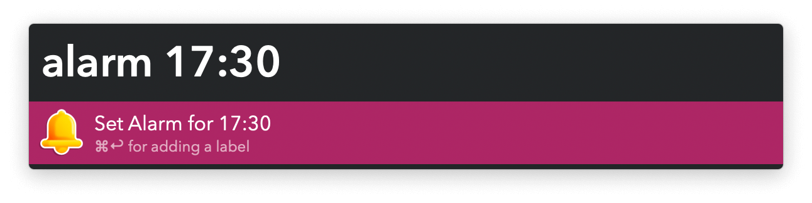
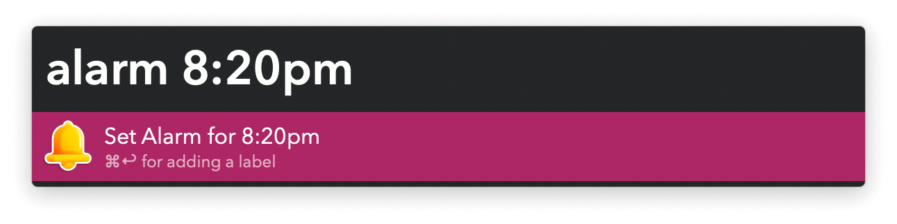

#  Shrieking Chimes Alfred Workflow

Set Timers and Alarms

<a href='https://alfred.app/workflows/vitor/shrieking-chimes'>⤓ Install on the Alfred Gallery</a>

## Usage

Set a timer via the Timer Keyword (default: `timer`) followed by a number. It defaults to minutes but you can specify hours or seconds.

Set an alarm via the Alarm Keyword (default: `alarm`) followed by a time.

Pressing <kbd>⌘</kbd><kbd>↩&#xFE0E;</kbd> allows setting a name for the alarm.

Edit alarms and timers in the macOS Clock app.
